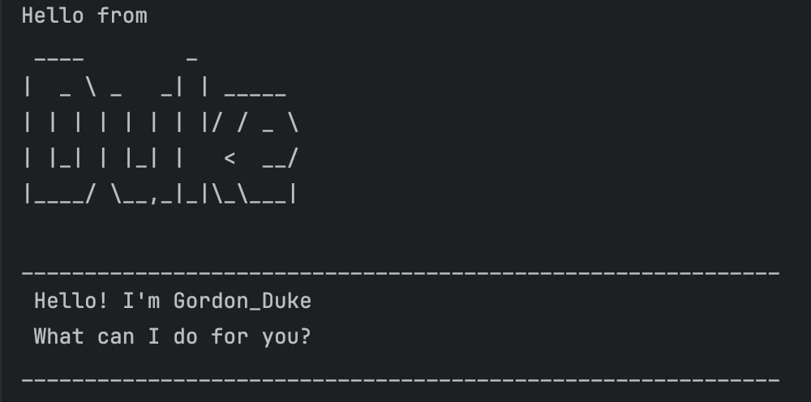

# Gordon_Duke User Guide



// Gordon_Duke is a personal task manager chatbot that helps you keep track of your todos, deadlines, and events.
You can use Duke to add, list out, mark, unmark, find and delete tasks, all from the command line.

## Adding todo

// add a todo task into list

// Format: todo NAME

// Examples of usage

Example: `todo stay happy`

// expected outcome

```
____________________________________________________________
well! ive added: 
[T][ ] stay happy
____________________________________________________________
```

## Adding deadline

// add a deadline task into list

// Format: deadline NAME/DATE

// Examples of usage

Example: `deadline homework/sun`

// expected outcome

```
____________________________________________________________
well! ive added: 
[D][ ] homework by: sun
____________________________________________________________
```

## Adding event

// add an event task into list

// Format: event NAME/FROM/TO

// Examples of usage

Example: `event sleep/10pm/6am`

// expected outcome

```
____________________________________________________________
well! ive added: 
[E][ ] sleep(from: 10pm to: 6am)
____________________________________________________________
```

## Deleting a task
// Deleting a task from the list

// Format: delete INDEX

// Examples of usage

Example: `delete 2`

// expected outcome

```
____________________________________________________________
well! ive deleted: 
[E][ ] happy(from: tur to: ee)
____________________________________________________________
```

## Find tasks
// Find tasks with the corresponding entry

// Format: find Entry

// Examples of usage

Example: `find h`

// expected outcome

```
____________________________________________________________
well, ive found these for you:
1. [D][ ] hwww by: wed
2. [T][ ] helloo
3. [D][ ] housework  by: mon
4. [T][ ] stay happy
5. [D][ ] homework by: sun
____________________________________________________________
```

## list out tasks
// list all the tasks

// Format: list

// Examples of usage

Example: `list`

// expected outcome

```
____________________________________________________________
1. [T][X] play vid games
2. [D][ ] hwww by: wed
3. [T][ ] helloo
4. [T][X] noway
5. [D][ ] housework  by: mon
6. [D][ ] wine by: d
7. [E][ ] gday(from: tue to: wed)
8. [T][ ] stay happy
9. [D][ ] homework by: sun
10. [E][ ] sleep(from: 10pm to: 6am)
____________________________________________________________
```
## Marking a task
// Marking a task from the list

// Format: mark INDEX

// Examples of usage

Example: `mark 2`

// expected outcome

```
____________________________________________________________
Nice! I've marked this task as done:
[D][X] hwww by: wed
____________________________________________________________
```
## Unmarking a task
// Unmarking a task from the list

// Format: unmark INDEX

// Examples of usage

Example: `unmark 2`

// expected outcome

```
____________________________________________________________
Nice! I've marked this task as undone:
[D][ ] hwww by: wed
____________________________________________________________
```